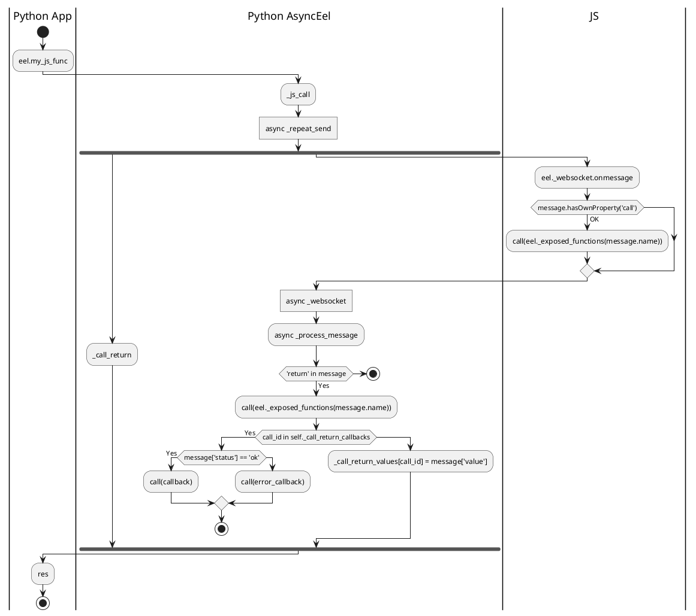

# Eel Developers

## Setting up your environment

In order to start developing with Eel you'll need to checkout the code, set up a development and testing environment, and check that everything is in order.

### Clone the repository
```bash
git clone https://github.com/lauler1/Async_eel
```

### (Recommended) Create a virtual environment
It's recommended that you use virtual environments for this project. Your process for setting up a virutal environment will vary depending on OS and tool of choice, but might look something like this:

```bash
cd <Async_eel/>                 # If not yet
python3 -m venv venv
source venv/bin/activate
```

**Note**: `venv` is listed in the `.gitignore` file so it's the recommended virtual environment name
    

### Install project requirements

```bash
cd <Async_eel/>                 # If not yet
pip3 install -r requirements.txt        # eel's 'prod' requirements

```
### Install for local use with PIP

```bash
cd <Async_eel/>                 # If not yet
pip install -e .
```

### Enabling IceCream outputs.

In order to enable the IceCream debug outputs to the console, use:

```python
from async_eel.async_eel import ic_instances
ic_instances.enable_all()
#or
ic_instances.disable_all()
```
By default they are disabled.

## Call flow from Python to JS

<!--

-->

