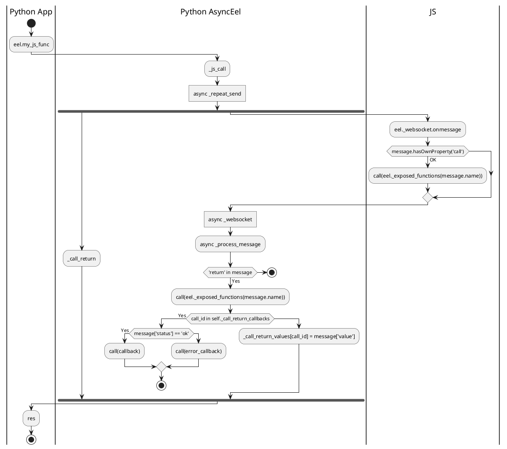
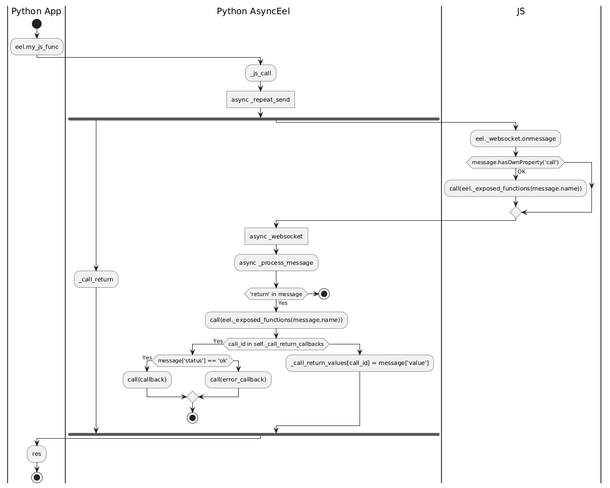

# Async Eel

This project is a fork of the [Python Eel](https://github.com/python-eel/Eel) library.

It provides an **asynchronous version** of Eel, built using the **Quart** server framework.

The source code can be found in the `async_eel/` directory.

A working example is available in `examples/async_callbacks/`.

This project does not yet have a PyPI (pip) installation package, but it is already functional for the provided example.

Feel free to contribute!

## Differences from synchronous Eel

On the **JavaScript side**, there are no changes.  
On the **Python side**, there are several differences, as described below.

***

### **Now implemented as a class that must be initialized**

```python
from async_eel import AsyncEel

eel = AsyncEel()
eel.init('web')
```

***

### **`start()` method**

*   `start` is now **asynchronous** (`async`) and no longer supports the `block` argument.
*   After calling `start`, you can wait for the WebSocket initialization using `AsyncEel.wait_ws_started`.

Example:

```python
async def main():
    await eel.start('callbacks.html', size=(400, 300), close_callback=close_callback)
    await eel.wait_ws_started

if __name__ == "__main__":
    asyncio.run(main())
```

***

### **Remote JavaScript calls**

*   Calls to remote JavaScript functions must now use `await`:

```python
res = await eel.js_random()()
await eel.js_random()(my_callback)
```

*   A more verbose (optional) syntax is also available:

```python
res = await eel.js_random().wait_answer()
eel.js_random().then_call(my_callback)
```

**Note:** In the new syntax, `then_call()` is **not** `async`.

***

### **Callbacks**

*   Callbacks can be either **async** or **sync**.
*   `AsyncEel` automatically detects whether a callback is asynchronous and calls it accordingly.

Examples:

```python
async def close_callback(page, sockets):
    print(f"close_callback({page}, {sockets}): websocket is closed")

@eel.expose
async def py_random():
    return random.random()

async def print_num(n):
    print('print_num: Got this from JavaScript:', n)
```

The above `async` functions work the same as these synchronous examples:

```python
def close_callback(page, sockets):
    print(f"close_callback({page}, {sockets}): websocket is closed")

@eel.expose
def py_random():
    return random.random()

def print_num(n):
    print('print_num: Got this from JavaScript:', n)
```


## Call from Python to JS

<!--

-->


